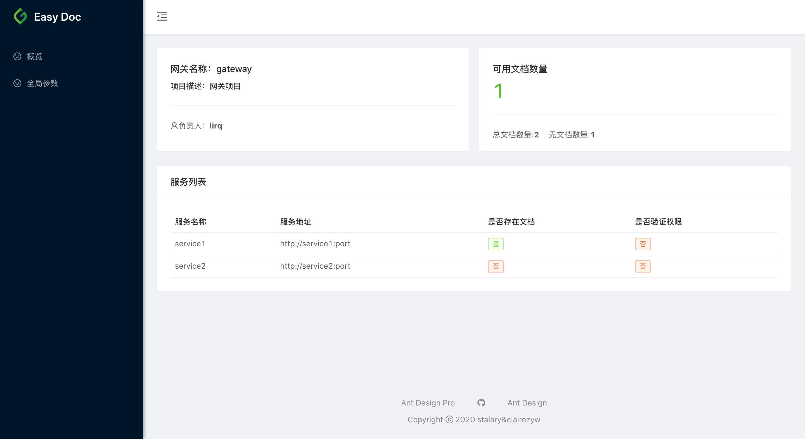
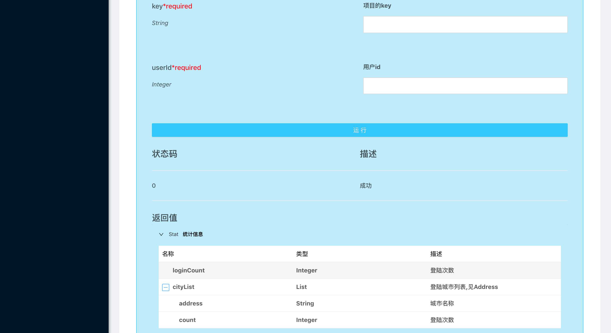
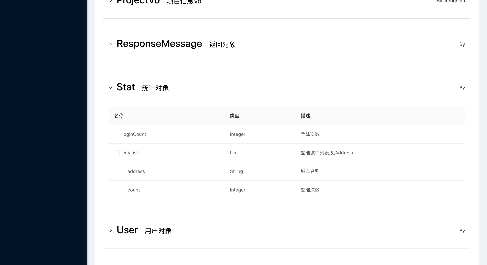
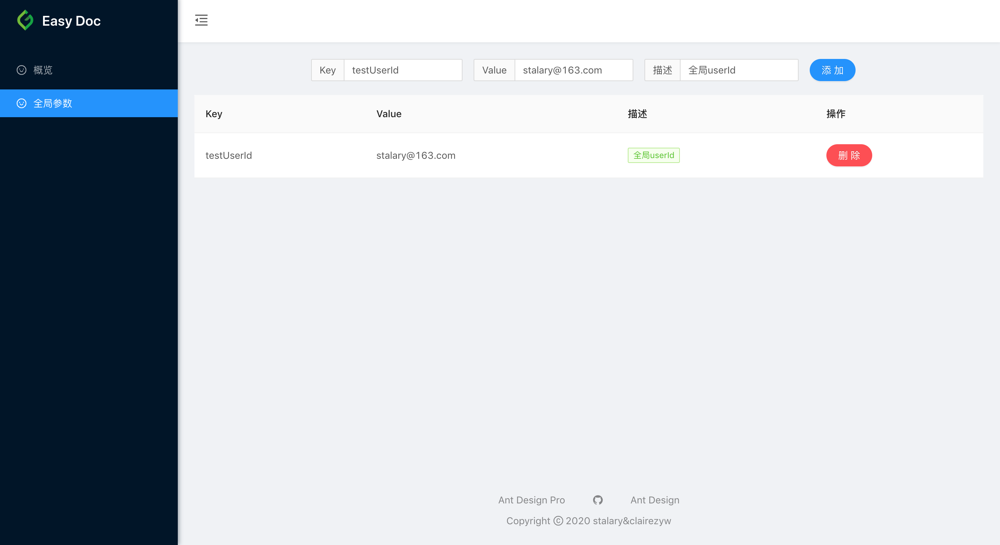

## 项目介绍
- 简单易用的 Java 接口文档生成器，基于 JavaDoc 风格的注释生成接口文档，对代码 0 侵入。
- 提供接口展示,对象展示,调用测试,全局参数配置等功能，目前最新稳定版本1.3.0，可以通过 maven 或者 gradle 直接使用
- 支持网关和服务模式,通过配置文件决定
- 支持通过 url 分享指定接口或者对象

## 使用方式
- 通过 service_ip:port/easy-doc.html 的方式访问
- 通过 service_url/easy-doc.html 的方式访问

## 网关模式效果图


## 服务模式效果图


## 接口详情效果图


## 对象列表效果图


## 全局参数效果图


## 设计思路
[设计思路文档](doc/design.md)

## 引入依赖方法
- [远程仓库地址](https://mvnrepository.com/artifact/com.stalary/easy-doc)
- 使用maven引入
```xml
<dependency>
    <groupId>com.stalary</groupId>
    <artifactId>easy-doc</artifactId>
    <version>${version}</version>
</dependency>
```
- 使用gradle引入
```groovy
dependencies {
  implementation('com.stalary:easy-doc:${version}')	
}
```

## 配置方式
- [网关配置](doc/gateway.md)
- [服务配置](doc/service.md)

## 注释书写规则
[规则介绍](doc/rule.md)

## 版本特性
[特性更新文档](doc/feature.md)

## Bug/Feature 提交
- Issues
- Email: stalary@163.com

## 参与贡献
- Pull Request

## 常见问题
- 子项目路径获取错误，参考https://blog.csdn.net/Jane0908007/article/details/106427557
